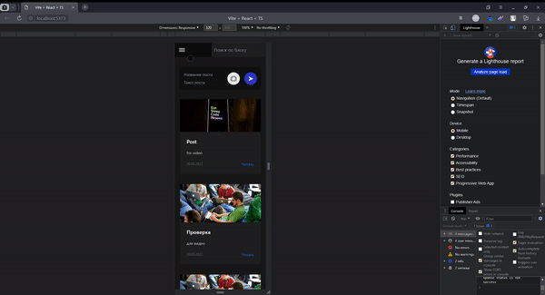

# Blog

Этот проект - **личный блог**, где человек может выкладывать свои посты, оставлять ссылки на свои проекты, а люди могут комментировать посты и написать сообщение владельцу блога на почту.
У данного проекта есть как **backend**, так и **frontend** часть.

## Фукнционал проекта

- Автор блога(в данной версии любой пользователь) может добавлять посты. Пост имеет **картинку**, которая хранится на бэкенде, и **текстовую часть**, а также **комментарии**, которые оставляют пользователи.
- Каждый пользователь может оставлять свои комментарии под постами.
- Для того чтобы оставлять комментарии надо **зарегестрироваться**, так же при регистрации **на электронную почту приходит подтверждение**, однако оно ни на что не влияет(на данный момент).
- Через сайт **можно связаться со мной, отправляя мне письмо на электронную почту**.
- Если постов слишком много, **можно воспользоваться поиском и найти нужный**.
- **Верстка адаптивная**, сайт адекватно смотрится и удобен в использовании на любом разрешении.

## Технологии проекта

### Frontend

1. **Typescript и React** - главная связка данного проекта. Для меня это был первый опыт работы с Typescript'ом, однако точно не последний.
2. CSS стили писались при помощи **Tailwind CSS** и **SCSS**, что значительно ускорило скорость верстки.
3. Стили импортировались при помощи **SCSS модулей**, что позволило отойти от БЭМ.
4. Для хранения состояний используется **Tanstack React Qury**, что значительнее сокращает и упрощает код.
5. В качестве сборщика проекта выбран **Vite**
6. Запросы на сервер сделаны с помощью **axios**.
7. Валидация форм происходит благодаря библиотеке **react hook form**.
8. Чтобы преоброзовать даты я использовал **dateformat**.

### Backend

1. Backend сделан на фреймворке **Express**.
2. В качестве БД выбран **MongoDB** и для работы с ней **mongoose**.
3. Для отправки писем используется **nodemailer**.

## Какие функции планируются в будущем?

1. Главная функция в будущем - это **отдельная страница с моими работами**, примерно как с постами. Сейчас это страница существует как заглушка. Я хочу добавить возможность добавлять мои работы, а также исктаь среди них и искать по тегам.
2. Добавить **теги** для каждого поста, и возможность искать по тегам.
3. Доработать комментарии: **возможность отвечать на комментарии**, сейчас там просто кнопка заглушка.
4. Возможность **зайти на профиль других пользователей**.
5. **Сообщать пользователю об ошибках**, ведь почти о всех ошибках можно узнать сейчас только в консоли.
6. Стремиться **сделать свой код лучше**
## Что мне нравится в этом проекте?

- Мне нравится, как я организовал **структуру проекта**. Я постарался вынести каждую самостояльную часть кода в отдельный файл, в отдельную функцию, в отдельный компонент, чтобы все было независемым. Это касается как файловой структуры, так и структуры самого кода.
- **Интерфейс у сайта получился говорящим и user-friendly**, каждая кнопочка реагирует, когда на нее наводишь мышку. Получилось достаточно понятно, что и как должно работать.
- Мелочь, но мне понравилась колонка "Интересно почитать", где при каждом обновлении страницы, **появляются ссылки на 4 рандомных поста**.
- Мне кажется, очень классным получилось **меню в мобильной версии**, оно появляется с приятной анимаций и не имеет ничего лишнего. Мне в целом нравится, как у меня получилось сделать адаптивную верстку в данном проекте.
- На мой взгляд получилась **приятния пагинация** с красивыми кнопочками

## Как работает проект?

### Главная страница

### Вход в профиль

### Посты

### Редактирования профиля

### Добавление поста

### Поиск постов

### Страница "Мои работы"

### Окно "Написать мне"

### Письмо подтверждения профиля и формата "написать мне"

### Адаптивная верстка на разных разрешениях

## Инструкция по установке проекта, для тех, кто хочет сам, все потыкать
1. В git прописываем git clone https://github.com/hiksP/blog.git
2. Переходим в директорию backend, устанавливаем все зависимости командой npm install, запускаем backend командой npm run dev
3. Повторояем все то же самое для фронтенда.
4. Переходим в браузере по ссылке http://localhost:5173/blog  и наслаждаемся.
